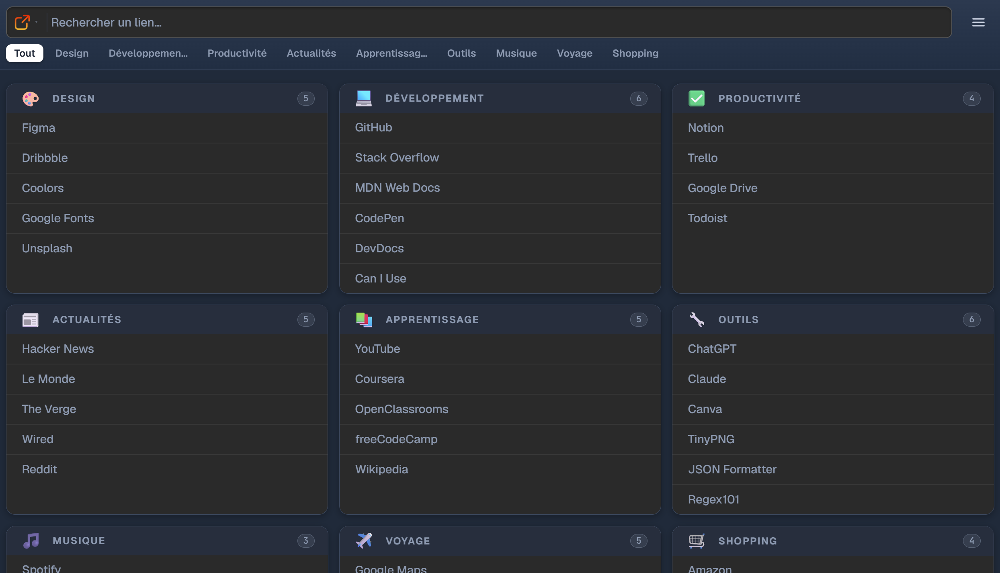
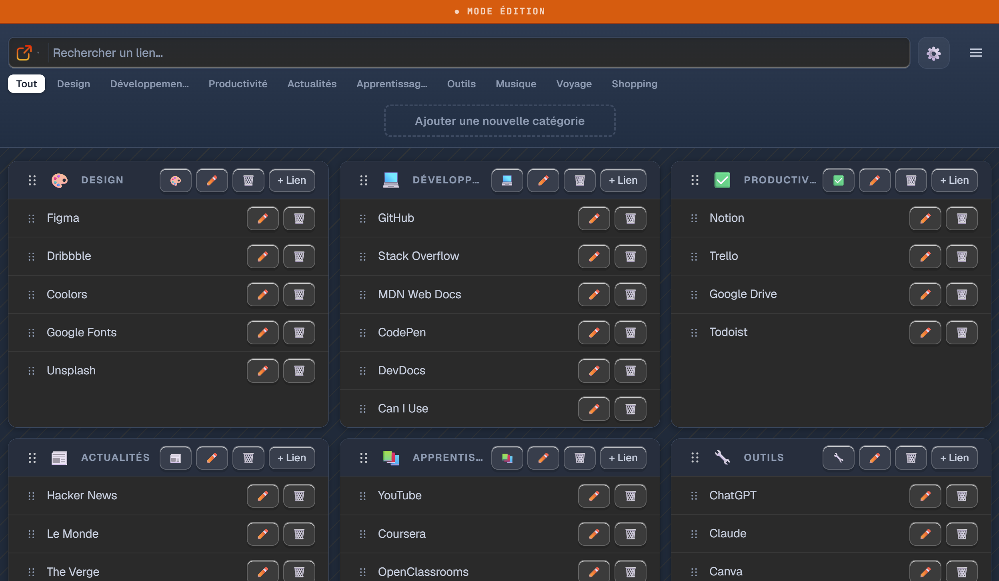
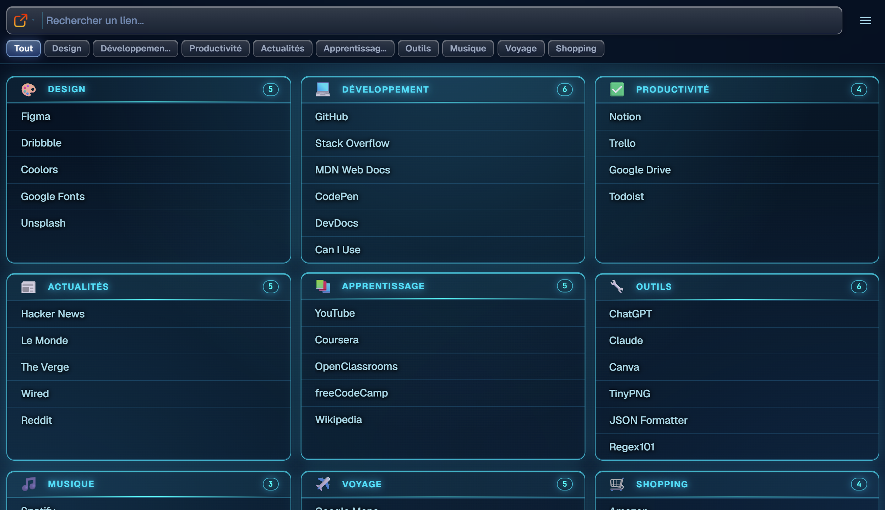

# 🔗 Mes Liens
> Organisez vos Liens Internet par catégories

  

---

## ✨ Présentation

Gestionnaire de liens organisés par catégories. Depuis une interface unique, ouvrez vos sites web, lancez des applications spécifiques (Teams, Outlook, Word, Excel…) ou déclenchez des requêtes HTTP(S) GET ou POST — le tout en un clic.

---

## 📸 Aperçu





---

## 🚀 Fonctionnalités

- 📁 **Catégories personnalisables** — organisez vos liens par thème
- 🏷️ **Icônes de catégories** — associez une icône emoji à chaque catégorie pour une navigation plus visuelle
- 🔍 **Barre de recherche multi-plateforme** — Trouvez un lien enregistré ou lancez une recherche sur Google, YouTube et SharePoint
- 🎨 **5 Thèmes visuels** — Personnalisez l'affichage selon vos préférences en un clic
- ✏️ **Mode édition** — ajoutez, modifiez, supprimez et réorganisez vos liens par glisser-déposer
- 🔗 **Raccourcis applications** — ouvrez rapidement Teams, Outlook, Zoom et d'autres apps depuis vos liens. Seules les applications listées ci-dessous sont supportées — les fichiers `.exe` ne peuvent pas être lancés directement
- 📡 **Requêtes GET / POST** — envoyez des requêtes HTTP avec headers et body personnalisés (utile pour APIs, webhooks…)
- 📱 **Compatible mobile** — interface adaptée avec boutons de navigation tactile en mode édition
- 💾 **Sauvegarde automatique** — chaque modification est instantanément enregistrée dans votre navigateur
- 📤 **Exporter liens (JSON) / Importer liens (JSON)** — transférez vos liens entre appareils
- 📶 **Mode hors-ligne (PWA)** — l'application fonctionne sans internet après la première visite sur l'url

---

## 📦 Installation

Aucune installation requise. Ouvrez simplement l'URL dans votre navigateur :

```
https://richardmaire.github.io/mes-liens/
```

Pour un accès rapide, ajoutez-la à votre écran d'accueil :
- **iPhone** : Safari → icône Partager → "Sur l'écran d'accueil"
- **Android** : Chrome → menu ⋮ → "Ajouter à l'écran d'accueil"

---

## 🛠️ Utilisation

### Ajouter un lien
1. Activez le **mode édition** via le menu ☰
2. Cliquez sur **"Ajouter une nouvelle catégorie"** ou sur **"+ Lien"** dans une catégorie existante
3. Renseignez le nom et l'URL — vos modifications sont automatiquement sauvegardées

### Transférer ses liens sur un autre appareil

1. Sur l'appareil source — menu ☰ → **📤 Exporter liens (JSON)** → enregistre les données des liens dans un fichier JSON
2. Sur le nouvel appareil — ouvrez l'URL, menu ☰ → **📥 Importer liens (JSON)** → sélectionnez le fichier JSON pour importer les liens

> Conseil : conservez ce fichier de données en lieu sûr comme sauvegarde.

### Barre de recherche

| Mode | Description |
|------|-------------|
| Mes liens | Filtre vos liens |
| Google | Lance une recherche Google (Entrée) |
| YouTube | Lance une recherche YouTube (Entrée) |
| SharePoint | Lance une recherche sur votre SharePoint (Entrée) |

### Requêtes GET / POST

Lors de la création ou modification d'un lien, vous pouvez choisir la méthode HTTP :

- **GET** (par défaut) — ouvre simplement l'URL dans un nouvel onglet
- **POST** — envoie une requête avec un body (Form data ou JSON) vers l'URL cible

Les liens POST sont identifiés par un badge `POST` visible sur le bouton du lien.

**Headers optionnels** — disponibles pour GET et POST, utiles pour les APIs nécessitant une authentification :

| Exemple | Valeur |
|---|---|
| `Authorization` | `Bearer mon_token` |
| `X-API-Key` | `ma_clé` |

**Exemples d'utilisation :**
- Appeler une **API REST** avec authentification Bearer
- Envoyer des données à un service tiers

### Ouvrir des applications directement

Tapez simplement le nom de l'application dans le champ URL :

| Ce que vous tapez | Application lancée |
|---|---|
| `teams` | Microsoft Teams |
| `outlook` | Microsoft Outlook |
| `excel` | Microsoft Excel |
| `word` | Microsoft Word |
| `powerpoint` | Microsoft PowerPoint |
| `onenote` | Microsoft OneNote |
| `zoom` | Zoom |
| `slack` | Slack |
| `skype` | Skype |
| `webex` | Cisco Webex |
| `notion` | Notion |
| `figma` | Figma |
| `vscode` | Visual Studio Code |
| `spotify` | Spotify |

> Ces raccourcis fonctionnent uniquement pour les applications listées ci-dessus, à condition qu'elles soient installées sur votre ordinateur. Il n'est pas possible de lancer d'autres applications ou fichiers `.exe`

### Ouvrir des fichiers locaux

Les fichiers Microsoft Office stockés localement (`C:\...`) s'ouvrent directement dans l'application correspondante en collant simplement leur chemin Windows dans le champ URL :

| Extensions | Application |
|---|---|
| `.docx`, `.doc`, `.docm` | Microsoft Word |
| `.xlsx`, `.xls`, `.xlsm` | Microsoft Excel |
| `.pptx`, `.ppt`, `.pptm` | Microsoft PowerPoint |
| `.vsd`, `.vsdx`, `.vsdm` | Microsoft Visio |
| `.mpp`, `.mpt` | Microsoft Project |
| `.accdb`, `.accde` | Microsoft Access |

> L'application correspondante doit être installée sur votre ordinateur.

Pour les autres types de fichiers (`.pdf`, etc.), utilisez un **lien de partage cloud** à la place du chemin local :

| Service | Comment obtenir le lien |
|---|---|
| **OneDrive / SharePoint** | Clic droit sur le fichier → *OneDrive → Copier le lien* |
| **Google Drive** | Clic droit → *Obtenir le lien* |
| **Autre** | Tout lien `https://` pointant vers le fichier fonctionne |

---

## 🔄 Mise à jour

Lorsque vous ouvrez l'application, elle est toujours à jour automatiquement. Aucune action requise de votre côté

---

## 📋 Prérequis

- Navigateur moderne : **Chrome**, **Edge**, **Safari** ou **Firefox**
- Connexion internet uniquement pour la première visite (ensuite fonctionne hors-ligne)

---

## 📄 Licence

Libre d'utilisation et de modification
