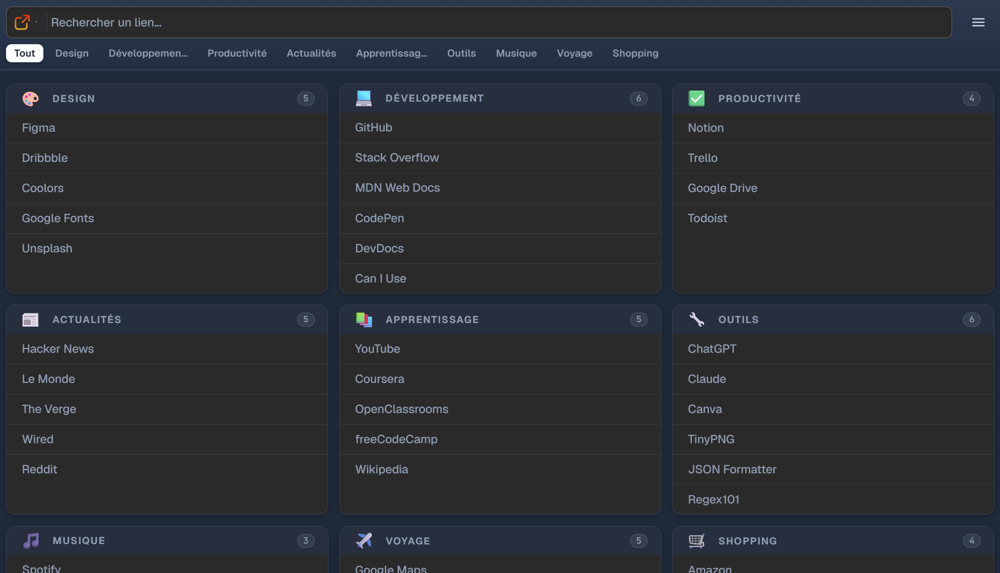
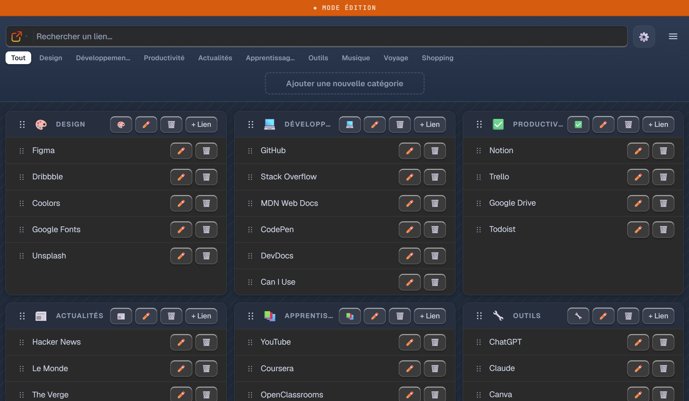
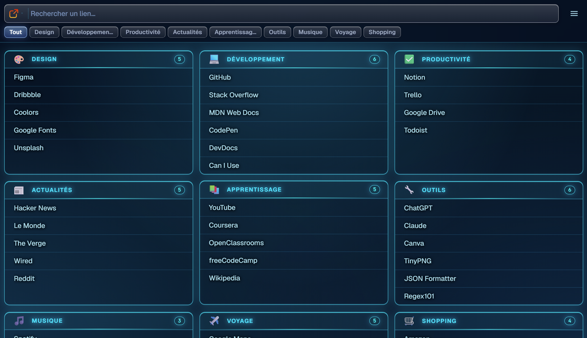

# 🔗 Mes Liens
> Organisez vos Liens Internet par catégories

  

---

## ✨ Présentation

Ce gestionnaire regroupe vos sites préférés dans des sections claires pour ouvrir une adresse (URL) en un coup d'œil. Il est aussi possible de créer des raccourcis vers certaines applications (Teams, Outlook, Zoom, Slack…), d'ouvrir des fichiers Office locaux et d'envoyer des requêtes POST.

---

## 📸 Aperçu





---

## 🚀 Fonctionnalités

- 📁 **Catégories personnalisables** — organisez vos liens par thème
- 🏷️ **Icônes de catégories** — associez une icône emoji à chaque catégorie pour une navigation plus visuelle
- 🔘 **Boutons filtres** — affichez une seule catégorie en un clic (activables/désactivables dans le menu ☰, visibles à partir de 2 catégories)
- 🔍 **Barre de recherche multi-moteurs** — filtrez vos liens ou lancez une recherche sur Google, YouTube ou SharePoint ; choisissez les moteurs affichés
- 🎨 **14 thèmes visuels** — Onyx, Saphir, Polaris, Ocre, Terracotta, Cirrus, Marbre, Métal, Obsidienne, Braise, Abyss, Cyber, Lagon, Aero
- ✏️ **Mode édition** — ajoutez, modifiez, supprimez et réorganisez catégories et liens par glisser-déposer
- 🖱️ **Ajout rapide** — glissez un lien depuis le navigateur sur une catégorie, ou collez une URL (Ctrl+V) en mode édition
- 🔗 **Tester l'URL** — vérifiez un lien directement depuis la fenêtre d'édition
- 📨 **Requêtes HTTP** — un lien peut envoyer une requête POST (body form data ou JSON) ou GET avec headers, par ex. pour piloter Home Assistant, avec notification du résultat
- 🧩 **Raccourcis applications** — ouvrez rapidement Teams, Outlook, Zoom et d'autres apps depuis vos liens. Seules les applications listées ci-dessous sont supportées — les fichiers `.exe` ne peuvent pas être lancés directement
- 📂 **Fichiers Office locaux** — collez un chemin `C:\...` pour ouvrir un fichier Word, Excel, PowerPoint, Visio, Project ou Access dans son application
- 📱 **Compatible mobile** — interface adaptée avec boutons ↑ / ↓ pour réorganiser en mode édition
- 💾 **Sauvegarde automatique** — chaque modification est instantanément enregistrée dans votre navigateur
- 📤 **Exporter liens (JSON) / Importer liens (JSON)** — transférez vos liens et réglages entre appareils
- 📶 **Mode hors-ligne (PWA)** — l'application fonctionne sans internet après la première visite sur l'URL

---

## 📦 Installation

Aucune installation requise. Ouvrez simplement l'URL dans votre navigateur :

```
https://richardmaire.github.io/mes-liens/
```

Pour un accès rapide, ajoutez-la à votre écran d'accueil :
- **iPhone** : Safari → icône Partager → "Sur l'écran d'accueil"
- **Android** : Chrome → menu ⋮ → "Ajouter à l'écran d'accueil"

---

## 🛠️ Utilisation

### Ajouter un lien
1. Activez le **mode édition** via le menu ☰ → **✏️ Entrer en mode édition**
2. Cliquez sur **"Ajouter une nouvelle catégorie"** ou sur **"+ Lien"** dans une catégorie existante
3. Renseignez le nom et l'URL — vos modifications sont automatiquement sauvegardées

Raccourcis en mode édition :
- **Glisser-déposer** un lien depuis un autre onglet ou la barre d'adresse sur une catégorie
- **Ctrl+V** sur une catégorie (hors champ de saisie) pour y coller une URL copiée
- Sur mobile, utilisez les boutons **↑ / ↓** pour déplacer liens et catégories

### Icône de catégorie
En mode édition, cliquez sur le bouton d'icône d'une catégorie pour choisir un emoji, ou **❌ Aucune icône** pour la retirer.

### Liens POST / requêtes HTTP
Dans la fenêtre d'édition d'un lien, choisissez **GET** (lien classique) ou **POST** :

| Format du body | Saisie | Envoyé avec |
|---|---|---|
| Form data | `clé=valeur`, une paire par ligne | `Content-Type: application/x-www-form-urlencoded` |
| JSON | Objet JSON (vérifié à l'enregistrement) | `Content-Type: application/json` |

Les **headers optionnels** (ex. `Authorization: Bearer <token>`) sont envoyés avec la requête.

- Un lien **POST** envoie la requête en arrière-plan et affiche une notification avec le résultat (✅ 200 OK, ❌ 401…) — aucun onglet n'est ouvert
- Un lien **GET avec headers** fonctionne de la même façon (badge **GET**) ; un lien GET sans header s'ouvre normalement

> ⚠️ Le serveur appelé doit autoriser l'origine `https://richardmaire.github.io` (CORS). Exemple pour Home Assistant, dans `configuration.yaml` :
> ```yaml
> http:
>   cors_allowed_origins:
>     - https://richardmaire.github.io
> ```

### Transférer ses liens sur un autre appareil

1. Sur l'appareil source — menu ☰ → **📤 Exporter liens (JSON)** → télécharge le fichier `Mes_Liens_data.json` (liens, URL SharePoint et réglages de recherche)
2. Sur le nouvel appareil — ouvrez l'URL, menu ☰ → **📥 Importer liens (JSON)** → sélectionnez le fichier

> ⚠️ L'import **remplace** tous les liens présents sur l'appareil.
>
> Conseil : conservez ce fichier en lieu sûr comme sauvegarde.

### Barre de recherche

Cliquez sur l'icône à gauche de la barre pour changer de mode :

| Mode | Description |
|------|-------------|
| Mes liens | Filtre vos liens — **Entrée** ouvre le premier résultat |
| Google | Lance une recherche Google (Entrée) |
| YouTube | Lance une recherche YouTube (Entrée) |
| SharePoint | Lance une recherche sur votre SharePoint (Entrée) |

**Échap** vide la recherche (ou quitte le champ s'il est déjà vide).

**Choisir les moteurs** : en mode édition, cliquez sur le bouton ⚙️ à droite de la barre de recherche, activez/désactivez Google, YouTube et SharePoint. Pour SharePoint, renseignez l'adresse de votre site (ex. `https://entreprise.sharepoint.com`).

### Thèmes

Menu ☰ → **🎨 Thèmes** → choisissez parmi les 14 thèmes. Le choix est mémorisé dans le navigateur.

### Ouvrir des applications directement

Tapez simplement le nom de l'application dans le champ URL :

| Ce que vous tapez | Application lancée |
|---|---|
| `teams` | Microsoft Teams |
| `outlook` | Microsoft Outlook |
| `excel` | Microsoft Excel |
| `word` | Microsoft Word |
| `powerpoint` | Microsoft PowerPoint |
| `onenote` | Microsoft OneNote |
| `zoom` | Zoom |
| `slack` | Slack |
| `skype` | Skype |
| `webex` | Cisco Webex |
| `notion` | Notion |
| `figma` | Figma |
| `vscode` | Visual Studio Code |
| `spotify` | Spotify |

> Ces raccourcis fonctionnent uniquement pour les applications listées ci-dessus, à condition qu'elles soient installées sur votre ordinateur. Il n'est pas possible de lancer d'autres applications ou fichiers `.exe`

### Ouvrir des fichiers locaux

Les fichiers Microsoft Office stockés localement (`C:\...`) ou sur un partage réseau (`\\serveur\...`) s'ouvrent directement dans l'application correspondante en collant simplement leur chemin Windows dans le champ URL :

| Extensions | Application |
|---|---|
| `.docx`, `.doc`, `.docm` | Microsoft Word |
| `.xlsx`, `.xls`, `.xlsm` | Microsoft Excel |
| `.pptx`, `.ppt`, `.pptm` | Microsoft PowerPoint |
| `.vsd`, `.vsdx`, `.vsdm` | Microsoft Visio |
| `.mpp`, `.mpt` | Microsoft Project |
| `.accdb`, `.accde` | Microsoft Access |

> L'application correspondante doit être installée sur votre ordinateur.

Pour les autres types de fichiers (`.pdf`, etc.), utilisez un **lien de partage cloud** à la place du chemin local :

| Service | Comment obtenir le lien |
|---|---|
| **OneDrive / SharePoint** | Clic droit sur le fichier → *OneDrive → Copier le lien* |
| **Google Drive** | Clic droit → *Obtenir le lien* |
| **Autre** | Tout lien `https://` pointant vers le fichier fonctionne |

---

## 🔄 Mise à jour

Lorsque vous ouvrez l'application avec une connexion, elle se met à jour automatiquement. Aucune action requise de votre côté.

Avec une connexion lente ou absente, la dernière version enregistrée s'affiche après 3 secondes maximum.

---

## 📋 Prérequis

- Navigateur moderne : **Chrome**, **Edge**, **Safari** ou **Firefox**
- Connexion internet uniquement pour la première visite (ensuite fonctionne hors-ligne, avec les polices système)

---

## 📄 Licence

Libre d'utilisation et de modification
